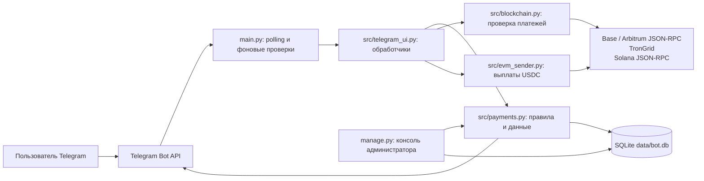

# DAO Payment Bot

Telegram-бот для оформления криптовалютных платежей за подписку и управления доступом в приватные чаты DAO.

## Overview

Пользователь выбирает тариф, токен и сеть, переводит средства на адрес кошелька проекта и отправляет боту хэш транзакции. Бот проверяет транзакцию через API выбранного блокчейна, сохраняет платёж и подписку в SQLite и выдаёт одноразовые ссылки-приглашения в чат и группу.

Приложение также обрабатывает истечение подписок и реферальные начисления. Для операторов предусмотрена отдельная интерактивная консоль `manage.py`. Публичного HTTP API у проекта нет.

## Features

- Тарифы: 1 месяц за $70, 3 месяца за $170 и бессрочный доступ за $350.
- Оплата USDC или USDT в поддерживаемых сетях. Бот проверяет успешность транзакции, токен, адрес получателя и минимальную сумму; повторно использовать уже записанный хэш нельзя.
- Одноразовые ссылки-приглашения в настроенные чат и группу.
- Уведомления об окончании подписки за 3 дня, 1 день и 1 час, а также после истечения. Фоновая задача проверяет подписки каждые 5 минут; после часового льготного периода бот удаляет пользователя из настроенных чатов.
- Реферальные ссылки с лимитом использований и индивидуальными ценами, одноразовые ссылки на бесплатный доступ и реферальные начисления.
- Вывод реферального баланса в USDC на Base или Arbitrum после обработки запроса в заданном Telegram-чате.
- Консоль администратора для просмотра пользователей и подписок, изменения подписок, генерации ссылок, просмотра балансов кошельков и рассылки пользователям без активной подписки.

## Tech Stack

- **Язык:** Python 3.14 или новее.
- **Telegram:** aiogram 3, long polling и конечный автомат состояний для диалогов.
- **Хранение:** SQLite (`data/bot.db`), стандартный модуль `sqlite3`.
- **Блокчейн:** `eth-account` для EVM-кошельков, `solders` и `base58` для Solana и адресов, `aiohttp` для асинхронных HTTP/JSON-RPC запросов.
- **Конфигурация и логи:** `python-dotenv`, Loguru.
- **Консоль администратора:** InquirerPy.
- **Управление зависимостями:** uv (`pyproject.toml`, `uv.lock`).

Внешние сервисы: Telegram Bot API и сетевые API блокчейнов. По умолчанию используются публичные RPC для Base, Arbitrum и Solana, а для Tron — TronGrid. Отдельный сервер базы данных, брокер очередей или кэш не требуются.

## Architecture



`main.py` загружает `.env`, инициализирует SQLite, регистрирует обработчики aiogram и запускает long polling. Платёжный диалог находится в `src/telegram_ui.py`: после выбора тарифа, токена и сети пользователь отправляет хэш, который проверяет `src/blockchain.py`. Бизнес-правила подписок, рефералов и запросов на вывод, а также создание схемы БД находятся в `src/payments.py`.

`manage.py` — отдельная интерактивная CLI-программа, работающая с той же локальной БД. Схему она не инициализирует: сначала запустите `main.py` с корректным `TELEGRAM_BOT_TOKEN`.

## Project Structure

```text
.
├── main.py              # Запуск Telegram-бота и периодическая проверка подписок
├── manage.py            # Интерактивная CLI для операторских задач
├── src/
│   ├── telegram_ui.py   # Команды, клавиатуры и обработчики диалогов
│   ├── payments.py      # SQLite, тарифы, подписки, рефералы и кошельки
│   ├── blockchain.py    # Проверка платежей в EVM, Tron и Solana
│   ├── evm_sender.py    # Отправка USDC на Base и Arbitrum
│   ├── states.py        # Состояния диалогов aiogram
│   └── logger.py        # Консольный и файловый логи
├── pyproject.toml       # Метаданные и зависимости проекта
├── .python-version      # Версия Python для uv: 3.14
└── uv.lock              # Зафиксированное разрешение зависимостей
```

При запуске из корня репозитория приложение создаёт `data/bot.db` и `logs/app.log`. Каталоги `data/` и `logs/` исключены из Git.

## Requirements / Prerequisites

- Python **3.14+** и [uv](https://docs.astral.sh/uv/).
- Telegram-бот и его токен.
- Для выдачи и отзыва доступа — ID целевых приватного чата и группы. Боту нужны права создавать ссылки-приглашения и удалять участников.
- Доступ к Telegram Bot API и RPC/API поддерживаемых сетей. Для TronGrid можно задать API-ключ; без него используется публичный endpoint.
- Для выплат реферального баланса — EVM-кошелёк, заданный через `WITHDRAWAL_WALLET_KEY`, с USDC и нативной монетой для комиссий в выбранной сети.
- Интерактивный терминал для `manage.py`.

SQLite входит в стандартную библиотеку Python; отдельная установка или запуск СУБД не нужны.

## Installation

Из корня клонированного репозитория установите Python и зависимости:

```bash
uv python install 3.14
uv sync
```

Создайте в корне репозитория файл `.env` и заполните настройки из раздела [Configuration](#configuration). Файла `.env.example` в репозитории нет. Для минимального запуска обязательно задайте `TELEGRAM_BOT_TOKEN`; для выдачи доступа настройте ID чата и группы.

## Configuration

`main.py` и `manage.py` загружают `.env` через `python-dotenv`. Секретные значения в репозиторий добавлять нельзя; `.env` уже указан в `.gitignore`.

**Важно для выплат:** обработчик подтверждения в `src/telegram_ui.py` не проверяет Telegram ID на список администраторов. Настройте `WITHDRAWAL_CHAT_ID` на закрытый чат, доступный только доверенным операторам: участник с доступом к сообщению запроса может нажать кнопку подтверждения.

| Variable | Required | Description | Default |
|---|---|---|---|
| `TELEGRAM_BOT_TOKEN` | Да | Токен Telegram-бота. Без него `main.py` завершится до инициализации БД. | Нет |
| `PRIVATE_CHAT_ID` | Для выдачи доступа | ID приватного чата, в который бот создаёт приглашения и из которого удаляет пользователей после окончания подписки. | `0` — отключено |
| `PRIVATE_GROUP_ID` | Для выдачи доступа | ID приватной группы для тех же операций. | `0` — отключено |
| `ADMIN_CHAT_ID` | Нет | Telegram chat ID для уведомлений о подтверждённых оплатах. | Не задано — уведомления не отправляются |
| `WITHDRAWAL_CHAT_ID` | Для обработки выводов | Чат, куда бот отправляет запросы на вывод с кнопкой подтверждения. | Не задано; запросы на вывод будут отменены с возвратом баланса |
| `WITHDRAWAL_WALLET_KEY` | Для отправки выводов | Приватный ключ EVM-кошелька, которым отправляется USDC в Base или Arbitrum. | Не задано |
| `BASE_RPC_URL` | Нет | URL JSON-RPC для Base. | `https://mainnet.base.org` |
| `ARBITRUM_RPC_URL` | Нет | URL JSON-RPC для Arbitrum One. | `https://arb1.arbitrum.io/rpc` |
| `SOLANA_RPC_URL` | Нет | URL JSON-RPC для Solana Mainnet. | `https://api.mainnet-beta.solana.com` |
| `TRONGRID_API_URL` | Нет | Базовый URL API TronGrid. | `https://api.trongrid.io` |
| `TRONGRID_API_KEY` | Нет | API-ключ TronGrid; отправляется заголовком `TRON-PRO-API-KEY`. | Пусто |

Поддержка токенов задана в `src/payments.py`: USDC доступен в Base, Arbitrum и Solana; USDT — в Base, Arbitrum, Tron и Solana. Переопределения RPC URL полезны, если публичный endpoint недоступен или требуется провайдер с собственным лимитом запросов.

## Running the Project

Запускайте команды из корня репозитория, чтобы относительные пути к `data/` и `logs/` указывали на ожидаемые каталоги.

```bash
uv run python main.py
```

При первом успешном старте `main.py` создаёт БД, применяет используемые приложением изменения схемы и генерирует мастер-кошельки, если их ещё нет. После этого бот начинает long polling и запускает фоновую проверку подписок. Процесс должен оставаться запущенным.

Для административных операций откройте второй терминал с интерактивной сессией:

```bash
uv run python manage.py
```

`manage.py` предоставляет меню для пользователей, подписок, балансов, мастер-кошельков, реферальных ссылок и рассылок. Для создания реферальной ссылки и рассылок нужен работающий токен бота; проверки блокчейн-балансов требуют доступа к соответствующим RPC/API.

## Database / Migrations

База хранится в `data/bot.db`; путь задан относительно текущего рабочего каталога. При запуске `main.py` функция `init_db()` создаёт таблицы и применяет встроенные проверки/изменения схемы через SQLite `CREATE TABLE` и `ALTER TABLE`. Отдельной системы миграций или команды миграции в репозитории нет.

База содержит профили, платежи, подписки, реферальные данные, запросы на вывод и мастер-кошельки. Приватные ключи мастер-кошельков сохраняются в SQLite без шифрования: ограничьте доступ к `data/bot.db` и его резервным копиям. Пункт **Export Master Wallets** в `manage.py` сохраняет ключи в `data/master_wallets_export.txt`, затем заменяет ключи в БД случайными заглушками; безопасно сохраните экспорт до выполнения этой операции.

## API

Проект не поднимает собственный HTTP-сервер и не содержит REST endpoints или OpenAPI-спецификации. Пользовательский интерфейс работает через Telegram-команду `/start`, inline-кнопки и сообщения.

Для чтения данных транзакций `src/blockchain.py` обращается к EVM JSON-RPC, TronGrid и Solana JSON-RPC. `src/evm_sender.py` использует EVM JSON-RPC для отправки USDC при обработке вывода.

## Development

- Запуск бота: `uv run python main.py`.
- Запуск интерактивной админ-консоли: `uv run python manage.py`.
- Зависимости устанавливаются и синхронизируются командой `uv sync`.
